# mono-agent architecture

This is the maintainer map for the repository. Start here when deciding where a change belongs; use the package README for the detailed contract of that package.

## System shape

`@mono-agent/agent-app` is the config-first composition root. It loads one validated config, resolves channel drivers, builds one responder per active channel, and publishes lifecycle/traceability state. The execution path then crosses narrow package boundaries:

```text
channel adapter
  -> agent-contracts request/stream interfaces
  -> agent-app responder composition
  -> agent-harness turn orchestration
  -> runtime-adapter
  -> agent-runtime provider implementation

optional side paths
  -> memory
  -> observability
  -> operator TUI/web surfaces
```

The exact workspace graph and package ownership descriptions are generated in [`PACKAGES.md`](./PACKAGES.md). The rules are enforced by `pnpm run check:architecture`.

## Layered composition map

**Diagram summary:** The app composes adapter-neutral config, request execution, runtime bridges, optional context and observability, communication adapters, and operator surfaces; arrows show the intended high-level dependency direction.

```mermaid
flowchart TB
  Host["Config-first app host<br/>mono-agent CLI or custom host"]

  subgraph Surfaces["Operator-surface choices"]
    Tui["@mono-agent/tui<br/>Terminal chat + read-only config"]
    Web["@mono-agent/web<br/>Always-on browser console"]
  end

  subgraph Communication["Communication adapter choices"]
    A2A["@mono-agent/a2a-adapter<br/>extra plugin: Agent Card discovery + text tasks"]
    Cron["@mono-agent/cron-adapter<br/>Scheduled invocations"]
    OpenAIApi["@mono-agent/openai-api-adapter<br/>OpenAI Chat Completions"]
    Slack["@mono-agent/slack-adapter<br/>Socket Mode + Web API"]
    Telegram["@mono-agent/telegram-adapter<br/>Bot API + long polling"]
    Webhook["@mono-agent/webhook-adapter<br/>HTTP sync/async invocation"]
    WhatsApp["@mono-agent/whatsapp-adapter<br/>extra plugin: Baileys socket + group trigger policy"]
    Messenger["@mono-agent/messenger-adapter<br/>extra plugin: Meta webhook + Send API"]
  end

  subgraph Core["Core contracts and config"]
    Contracts["@mono-agent/agent-contracts<br/>request/response/stream/settings helpers"]
    Config["@mono-agent/config<br/>core runtime/context settings"]
  end

  subgraph PromptContext["Context layer"]
    Memory["@mono-agent/memory<br/>./store SQLite, ./search embeddings, ./bujo engine"]
    MemorySupermemory["@mono-agent/memory-supermemory<br/>extra plugin: Supermemory-backed store"]
  end

  subgraph AppLayer["App layer"]
    AgentApp["@mono-agent/agent-app<br/>config to channels + responder"]
  end

  subgraph Execution["Execution layer"]
    Harness["@mono-agent/agent-harness<br/>request to runtime run<br/>context + skills + tool policy"]
    Orchestrator["@mono-agent/agent-orchestrator<br/>extra: collaborator MCP tool"]
    Observability["@mono-agent/observability<br/>JSONL events + summaries + trace registry"]
  end

  subgraph Runtime["Pi runtime"]
    RuntimeAdapter["@mono-agent/runtime-adapter<br/>model refs + sandbox policy"]
    AgentRuntime["@mono-agent/agent-runtime<br/>Pi implementation"]
    PiSdk["Pi providers<br/>&lt;provider&gt;:&lt;model&gt;"]
  end

  Host -. optional .-> Tui
  Host -. optional .-> Web
  Host --> Telegram
  Host -. plugin .-> A2A
  Host --> Webhook
  Host --> OpenAIApi
  Host --> Cron
  Host -. optional package .-> Slack
  Host -. plugin .-> WhatsApp
  Host -. plugin .-> Messenger
  Host -. runtime extension .-> Orchestrator
  Host --> Config
  Host --> AgentApp

  Tui --> Contracts
  Tui --> Config
  Web --> Contracts
  Web --> Config
  Telegram --> Contracts
  A2A --> Contracts
  Cron --> Contracts
  OpenAIApi --> Contracts
  Slack --> Contracts
  Webhook --> Contracts
  WhatsApp --> Contracts
  Messenger --> Contracts

  Orchestrator --> Contracts
  Orchestrator -.->|runtime extension| Harness
  AgentApp --> Config
  AgentApp --> Harness
  AgentApp --> Memory
  AgentApp -. optional backend .-> MemorySupermemory
  AgentApp --> RuntimeAdapter
  AgentApp --> Observability
  Config --> Contracts
  Config --> RuntimeAdapter
  Harness --> Contracts
  MemorySupermemory --> Contracts
  Harness --> RuntimeAdapter
  Harness --> Observability

  RuntimeAdapter --> AgentRuntime
  RuntimeAdapter --> Contracts
  AgentRuntime --> PiSdk
```



## Dependency direction

```text
Static manifest dependencies (abridged; see PACKAGES.md for every edge)

@mono-agent/agent-app
  ├─ config + agent-contracts
  ├─ agent-harness
  ├─ runtime-adapter ── agent-runtime
  ├─ memory + observability
  ├─ built-in channel adapters
  ├─ operator-adapter
  └─ tui + web

agent-harness ── agent-contracts + runtime-adapter + observability
tui / web ── agent-contracts + config + observability

Runtime-only composition (not manifest dependency edges)

tui / web ── HTTP operator protocol ──> operator-adapter
agent-app ── channels.plugins[] ──> a2a-adapter / whatsapp-adapter / messenger-adapter
agent-app ── selected memory backend ──> memory-supermemory
custom host ── request-scoped extension ──> agent-orchestrator
authoring harness ── explicit MCP companion ──> docs-mcp
```

Rules for future packages:

- New publishable packages live under `packages/<package-name>` and publish as `@mono-agent/<package-name>`.
- Optional plugin-tier add-ons may live under `extras/<package-name>` when cataloged with `publishable: true` and `tier: "plugin"` (published in the lockstep but outside the core app closure).
- Add every workspace package to `scripts/package-catalog.mjs` with category, responsibility, and allowed dependency categories.
- Communication packages use `*-adapter` naming and must not depend on other adapters, the harness, or operator surfaces.
- Core config stays adapter-neutral; adapter credentials and allowlists live with the adapter package.
- Operator surfaces register field groups from other packages; they do not hardcode adapter settings.

## Where changes belong

| Change | Primary owner |
| --- | --- |
| Shared request, stream, channel, or host-safety contract | `packages/agent-contracts` |
| Config schema, validation, or source precedence | `packages/config` |
| Host/CLI/config composition | `packages/agent-app` |
| One request, tools, MCP, approvals, or structured output | `packages/agent-harness` |
| Provider routing or sandbox facade | `packages/runtime-adapter` |
| Provider implementation or runtime sessions | `packages/agent-runtime` |
| Transport-specific behavior | The matching `*-adapter` package |
| Memory persistence, recall, or maintenance | `packages/memory` or an explicitly selected plugin backend |
| Run artifacts, trace discovery, or exporters | `packages/observability` |
| Terminal/browser operator experience | `packages/tui`, `packages/web`, or `packages/operator-adapter` |

Choose the lowest rung in [`docs/reference/capability-ladder.md`](./docs/reference/capability-ladder.md). A shared contract change is the last resort, not the default home for reusable-looking code.

## Agent-app internals

`app-controller.ts` owns lifecycle state and delegates operations. Each `app-controller-*.ts` module declares the narrow controller port it needs; operation modules must not import the concrete controller. Cross-cutting service logic lives in focused modules such as `background-log-maintenance.ts`, `doctor-observability.ts`, and `managed-web-logs.ts` rather than returning to the CLI/controller entrypoints.

The normal lifecycle is:

1. Strictly load config and resolve channel drivers.
2. Establish sandbox, traceability, exporters, and continuation services.
3. Start configured channels and their responders.
4. Publish the completed startup snapshot.
5. On reload or stop, block new work, stop transports, dispose responders/runtimes, and close shared services with bounded waits.

## Generated surfaces

Do not hand-edit generated blocks or inventories:

- `pnpm run generate:package-docs` owns catalog metadata, `PACKAGES.md`, and package-directory tables.
- `pnpm run generate:public-api-docs` owns package public API inventories and migration subpath inventories.
- `pnpm run generate:config-reference` owns the JSON schema and config-reference tables from the typed config metadata.

Architecture and docs checks fail when these outputs drift. Narrative package responsibilities and examples remain hand-authored beside their generated blocks.

## Change discipline

- Keep one responsibility per package and one reason to change per module.
- Prefer explicit typed inputs over reaching into a composition root's full state.
- Keep queues, retained samples, log files, streams, and shutdown waits bounded.
- Preserve real failure states; do not replace provider or transport failures with fallback success.
- Add behavior tests at the owning boundary, then select verification from the diff's risk.

See [`CONTRIBUTING.md`](./CONTRIBUTING.md) for the development and verification workflow.
