# Package Layers

`scripts/package-catalog.mjs` is the source of truth for package category metadata and dependency boundary checks. Core packages live under `packages/<package-name>`; optional **plugin-tier** extras live under `extras/<package-name>` (marked `tier: "plugin"`). Both tiers are `publishable: true` and release together on the npm lockstep tag, but plugin-tier extras are not part of the core `@mono-agent/agent-app` dependency closure — channels load through `channels.plugins[]`, orchestration is a request-scoped runtime extension, Supermemory resolves only when `memory.backend` explicitly selects the installed plugin, and docs-mcp is paired explicitly as an authoring-harness companion. The diagram shows logical layers, not filesystem nesting.

Current catalog count: 17 core publishable packages plus 5 plugin-tier extras (also publishable, released in the same lockstep) plus 1 unscoped alias (`create-mono-agent`, the `npm create mono-agent` installer whose `create-mono-agent`/`mono-agent` bins delegate to `@mono-agent/agent-app`).

```mermaid
flowchart TB
  subgraph HostDemos["Demo composition"]
    FinalDemo["demos/final-agent"]
  end

  subgraph App["app"]
    AgentApp["@mono-agent/agent-app"]
  end

  subgraph OperatorSurfaces["operator-surface"]
    SessionWeb["@mono-agent/session-web"]
    Tui["@mono-agent/tui"]
    Web["@mono-agent/web"]
  end

  subgraph Communication["communication"]
    A2A["@mono-agent/a2a-adapter\nextra"]
    Cron["@mono-agent/cron-adapter"]
    OpenAIApi["@mono-agent/openai-api-adapter"]
    OperatorAdapter["@mono-agent/operator-adapter"]
    Slack["@mono-agent/slack-adapter"]
    Telegram["@mono-agent/telegram-adapter"]
    WhatsApp["@mono-agent/whatsapp-adapter\nextra"]
    Webhook["@mono-agent/webhook-adapter"]
  end

  subgraph Execution["execution"]
    Harness["@mono-agent/agent-harness"]
    Orchestrator["@mono-agent/agent-orchestrator\nextra"]
  end

  subgraph ContextLayer["context"]
    DocsMcp["@mono-agent/docs-mcp\nextra"]
    Memory["@mono-agent/memory\n./store ./search ./bujo"]
    MemorySupermemory["@mono-agent/memory-supermemory\nextra"]
  end

  subgraph ObservabilityLayer["observability"]
    Observability["@mono-agent/observability"]
  end

  subgraph Core["core"]
    Contracts["@mono-agent/agent-contracts"]
    Config["@mono-agent/config"]
  end

  subgraph Runtime["runtime"]
    RuntimeAdapter["@mono-agent/runtime-adapter"]
    AgentRuntime["@mono-agent/agent-runtime"]
  end

  FinalDemo --> AgentApp

  AgentApp --> A2A
  AgentApp --> Cron
  AgentApp --> OpenAIApi
  AgentApp --> OperatorAdapter
  AgentApp --> Slack
  AgentApp --> Telegram
  AgentApp --> WhatsApp
  AgentApp --> Webhook
  AgentApp --> SessionWeb
  AgentApp --> Tui
  AgentApp --> Web
  AgentApp --> Harness
  AgentApp --> Config
  AgentApp --> Memory
  AgentApp -. install-skill companion .-> DocsMcp
  AgentApp -. optional backend .-> MemorySupermemory
  AgentApp --> Observability
  AgentApp --> RuntimeAdapter

  Tui --> Contracts
  Tui --> Config
  Tui --> Observability
  SessionWeb --> Observability
  Web --> Contracts
  Web --> Config
  Web --> Observability

  A2A --> Contracts
  Cron --> Contracts
  OpenAIApi --> Contracts
  OperatorAdapter --> Contracts
  Slack --> Contracts
  Telegram --> Contracts
  WhatsApp --> Contracts
  Webhook --> Contracts

  Harness --> Contracts
  Harness --> Observability
  Harness --> RuntimeAdapter
  Orchestrator --> Contracts
  Orchestrator -.->|request-scoped MCP runtime options| Harness
  Config --> Contracts
  Config --> RuntimeAdapter
  Memory --> Contracts
  MemorySupermemory --> Contracts
  RuntimeAdapter --> AgentRuntime
  RuntimeAdapter --> Contracts
```

## Current Packages

| Layer | Packages |
| --- | --- |
| `runtime` | `@mono-agent/agent-runtime`, `@mono-agent/runtime-adapter` |
| `core` | `@mono-agent/agent-contracts`, `@mono-agent/config` |
| `context` | `@mono-agent/docs-mcp` (extra), `@mono-agent/memory`, `@mono-agent/memory-supermemory` (extra) |
| `execution` | `@mono-agent/agent-harness`, `@mono-agent/agent-orchestrator` (extra) |
| `observability` | `@mono-agent/observability` |
| `communication` | `@mono-agent/a2a-adapter` (extra), `@mono-agent/cron-adapter`, `@mono-agent/openai-api-adapter`, `@mono-agent/operator-adapter`, `@mono-agent/slack-adapter`, `@mono-agent/telegram-adapter`, `@mono-agent/webhook-adapter`, `@mono-agent/whatsapp-adapter` (extra) |
| `operator-surface` | `@mono-agent/session-web`, `@mono-agent/tui`, `@mono-agent/web` |
| `app` | `@mono-agent/agent-app` |

`@mono-agent/runtime-adapter` wraps the in-repo `@mono-agent/agent-runtime` package (claude / claude-code-cli / codex-app-cli / pi-sdk backends, with provider session support). Configured hosts use this one runtime implementation path by default; programmatic hosts may still pass any custom `MonoRuntimeLike` to `createConfiguredAgentResponder({ runtime, model })` when they genuinely need a private escape hatch.

Built-in channel sections are `telegram`, `slack`, `webhook`, `openaiApi`,
`cron`, `tui`, and `live`. External channel packages such as
`@mono-agent/a2a-adapter` and `@mono-agent/whatsapp-adapter` load through
`channels.plugins[]` and must return the normal `ChannelDriver` shape from
`@mono-agent/agent-contracts`.
