# Package Layers

```mermaid
flowchart TB
  subgraph HostDemos["Host/demo composition"]
    FinalDemo["demos/final-agent"]
    MultiDemo["demos/multi-agent"]
    AgentsSdkDemo["demos/agents-sdk-demo"]
    DownloadsCurator["demos/downloads-curator"]
  end

  subgraph App["app"]
    AgentApp["@mono-agent/agent-app"]
  end

  subgraph OperatorSurfaces["operator-surface"]
    OperatorConsole["@mono-agent/operator-console"]
    Tui["@mono-agent/tui"]
  end

  subgraph Communication["communication"]
    A2A["@mono-agent/a2a-adapter"]
    Cron["@mono-agent/cron-adapter"]
    OpenAIApi["@mono-agent/openai-api-adapter"]
    Slack["@mono-agent/slack-adapter"]
    Telegram["@mono-agent/telegram-adapter"]
    WhatsApp["@mono-agent/whatsapp-adapter"]
    Webhook["@mono-agent/webhook-adapter"]
  end

  subgraph Execution["execution"]
    Harness["@mono-agent/agent-harness"]
    Host["@mono-agent/agent-host"]
    Orchestrator["@mono-agent/agent-orchestrator"]
  end

  subgraph ContextLayer["context"]
    Context["@mono-agent/context"]
    Skills["@mono-agent/skills"]
    MemoryMd["@mono-agent/memory-md"]
    MemoryJournal["@mono-agent/memory-journal"]
    MemoryGraph["@mono-agent/memory-graph"]
    MemorySearch["@mono-agent/memory-search"]
    MemoryMcp["@mono-agent/memory-mcp"]
  end

  subgraph ObservabilityLayer["observability"]
    Observability["@mono-agent/observability"]
  end

  subgraph EvaluationLayer["evaluation"]
    AgentEvals["@mono-agent/agent-evals"]
  end

  subgraph Core["core"]
    Contracts["@mono-agent/agent-contracts"]
    Settings["@mono-agent/settings"]
    Config["@mono-agent/config"]
    ToolPolicy["@mono-agent/tool-policy"]
  end

  subgraph Runtime["runtime"]
    RuntimeAdapter["@mono-agent/runtime-adapter"]
    AgentRuntime["@mono-agent/agent-runtime"]
    OpenAIAgents["@mono-agent/openai-agents-runtime"]
    Sandbox["@mono-agent/sandbox"]
  end

  FinalDemo --> AgentApp

  AgentApp --> OperatorConsole
  AgentApp --> A2A
  AgentApp --> Cron
  AgentApp --> OpenAIApi
  AgentApp --> Slack
  AgentApp --> Telegram
  AgentApp --> WhatsApp
  AgentApp --> Webhook
  AgentApp --> Host
  AgentApp --> Config
  AgentApp --> Observability

  MultiDemo --> OperatorConsole
  MultiDemo --> A2A
  MultiDemo --> Telegram
  MultiDemo --> Orchestrator
  MultiDemo --> Host
  MultiDemo --> Config

  OperatorConsole --> Settings
  OperatorConsole --> Observability
  Tui --> Contracts
  Tui --> Config

  A2A --> Contracts
  A2A --> Settings
  Cron --> Contracts
  Cron --> Settings
  OpenAIApi --> Contracts
  OpenAIApi --> Settings
  Slack --> Contracts
  Slack --> Settings
  Telegram --> Contracts
  Telegram --> Settings
  WhatsApp --> Contracts
  WhatsApp --> Settings
  Webhook --> Contracts
  Webhook --> Settings

  Host --> Harness
  Host --> Config
  Host --> MemoryMd
  Host --> MemoryJournal
  Host --> MemoryGraph
  Host --> Observability
  Host --> RuntimeAdapter
  Host --> Sandbox
  Host --> ToolPolicy
  Harness --> Contracts
  Harness --> Context
  Harness --> MemoryMd
  Harness --> Observability
  Harness --> RuntimeAdapter
  Harness --> Sandbox
  Harness --> Skills
  Harness --> ToolPolicy
  Orchestrator --> Contracts
  Orchestrator -.->|request-scoped MCP runtime options| Harness
  AgentEvals --> Contracts
  AgentEvals --> Harness
  AgentEvals --> Observability

  Config --> Settings
  Config --> RuntimeAdapter
  Config --> Sandbox
  Skills --> Context
  MemoryJournal --> MemoryMd
  MemoryMcp --> MemoryJournal
  MemoryMcp --> MemoryGraph
  RuntimeAdapter --> AgentRuntime
  RuntimeAdapter --> Sandbox
  AgentRuntime --> Sandbox
  Sandbox --> Contracts
  OpenAIAgents --> RuntimeAdapter
```

`scripts/package-catalog.mjs` is the source of truth for package category metadata and dependency boundary checks. The workspace layout remains flat under `packages/<package-name>`; the diagram shows logical layers, not filesystem nesting.

## Current Packages

| Layer | Packages |
| --- | --- |
| `runtime` | `@mono-agent/agent-runtime`, `@mono-agent/runtime-adapter`, `@mono-agent/openai-agents-runtime`, `@mono-agent/sandbox` |
| `core` | `@mono-agent/agent-contracts`, `@mono-agent/config`, `@mono-agent/settings`, `@mono-agent/tool-policy` |
| `context` | `@mono-agent/context`, `@mono-agent/skills`, `@mono-agent/memory-md`, `@mono-agent/memory-journal`, `@mono-agent/memory-graph`, `@mono-agent/memory-search`, `@mono-agent/memory-mcp` |
| `execution` | `@mono-agent/agent-harness`, `@mono-agent/agent-host`, `@mono-agent/agent-orchestrator` |
| `observability` | `@mono-agent/observability` |
| `evaluation` | `@mono-agent/agent-evals` |
| `communication` | `@mono-agent/a2a-adapter`, `@mono-agent/cron-adapter`, `@mono-agent/openai-api-adapter`, `@mono-agent/slack-adapter`, `@mono-agent/telegram-adapter`, `@mono-agent/webhook-adapter`, `@mono-agent/whatsapp-adapter` |
| `operator-surface` | `@mono-agent/operator-console`, `@mono-agent/tui` |
| `app` | `@mono-agent/agent-app` |

`@mono-agent/runtime-adapter` wraps the in-repo `@mono-agent/agent-runtime` package (claude / claude-code-cli / codex-app-cli / pi-sdk backends, with provider session support). `@mono-agent/openai-agents-runtime` remains an additional first-class adapter for the OpenAI Agents SDK; Claude and Codex both flow through `agent-runtime`. Hosts choose one runtime per responder at composition time via `createConfiguredAgentResponder({ runtime, model })`.
