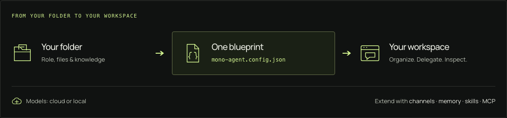

# mono-agent

**An AI companion you can shape, run, and embed.**

Use the workspace to work with your agent. Use the framework to build it into your own application. Choose cloud or local models, give the agent a role and tools, and compose its behavior in `mono-agent.config.json` rather than maintaining a custom host.

This is the technical next step from the [landing-page source](./marketing/): how the pieces fit, how to run them, and where to extend them. For technical users who want to configure and operate their own agent—not a zero-setup hosted assistant.

[Get started](#quickstart-an-agent-folder-from-one-config-file) · [Build on it](#embed-the-agent) · [Documentation](https://mono-agent-docs.vercel.app/) · [Safety](#safety-and-privacy)

<picture>
  <source media="(max-width: 640px)" srcset="./docs/assets/mono-agent-workspace-mobile.png" />
  
</picture>

*One agent, from folder to workspace. A conceptual diagram, not a runtime screenshot. Model and tool requests go to the services you configure; local-first does not mean local-only.*

## Why build with Mono Agent?

- **A companion shaped around your work.** Define its role and context, select tools and skills, and add optional memory. Use it to research, write, work in a repository, or carry out a recurring task.
- **Your models, not a fixed provider.** Select supported subscription/API routes or local models. Configure fallbacks where useful; provider availability and credentials still determine whether a request succeeds.
- **Actions, not just answers.** Agents can inspect files, run commands, use MCP tools, and delegate focused work to persistent subagents. Keep follow-up conversations and inspect retained execution evidence after an interruption.
- **A workspace and a framework.** Start in the browser; later embed a configured responder or compose a lower-level harness in TypeScript. You choose how much infrastructure to own.

Projects and tags help organize the browser workspace, with project context available to member conversations. They support the workflow; the agent itself is not tied to the browser. Configured channels include Telegram, Slack, webhooks, an OpenAI-compatible endpoint, and cron. Each channel has its own conversation history.

## Release status

The published baseline checked on 2026-09-20 is **`create-mono-agent@0.22.0`**. Projects, tags and persistent subagents are included in that release. This README also follows current source, so use the [versioned release notes](https://github.com/robertsreberski/mono-agent/releases/tag/v0.22.0) when evaluating an installed version. The [older release comparison](./docs/reference/release-status.md) currently records the 0.21.1 boundary, not the latest npm baseline.

## Quickstart: An Agent Folder From One Config File

Any folder — empty or already holding knowledge (`AGENTS.md`, `CLAUDE.md`, docs) — can become a running agent from one `mono-agent.config.json`. You need Node.js 24.15.0 or newer and credentials for the model you choose; a local provider such as Ollama works too.

Guided setup is authentic and not instant: it signs you in to the provider you choose and makes one real model request for every selected route to prove the route answers. That can take several minutes and counts as usage on your account. Running with flags, `--yes`, or without a TTY skips all of it and writes the scaffold only; add `--auth` if you want provider setup on that automated path too. [Setup details](#setup-details) list the exact deadlines, flags, and files.


### 1. Install the CLI

```bash
npm i -g create-mono-agent
```

`create-mono-agent` puts the natural `mono-agent` command on your `PATH`. It needs Node.js 24.15.0 or newer and no pnpm. Prefer a one-shot scaffold or a pinned install? [Install & prerequisites](./docs/getting-started/install.md) covers `npm create`, `npm exec`, the scoped package, and building from source.

### 2. Create the agent folder

```bash
mkdir my-agent
cd my-agent
mono-agent init
```

Bare `init` on a terminal is the guided wizard: name the agent, write its Role, choose models and capabilities, and complete any provider setup. It proves each selected route before it calls the folder ready, and on macOS it also starts the agent. Any flag, or a non-TTY run, writes the scaffold only and makes no readiness claim — then validate and start it yourself.

### 3. Validate and start the agent

```bash
mono-agent validate
mono-agent start                  # background service on macOS and Linux
mono-agent status                 # confirm the running instance
```

If guided init already started the agent, `status` confirms it in place of `start`; on Linux, guided setup prints this start step for you to run yourself. Without a usable service manager, run `mono-agent start --foreground` and keep that terminal open.

### 4. Open the web workspace

Run the browser console in its own terminal, bound to this computer, and open the URL it prints:

```bash
mono-agent web run --loopback
```

Open <http://127.0.0.1:5050>, choose the running agent, and start a conversation. Conversations and in-flight turns live in the service, so refreshing or closing a tab does not abort the work — but keep this terminal open. If you started the agent with `--foreground` too, that is a second terminal.

Want the console to keep running in the background? `mono-agent web start` installs it as a service instead, bound to the same loopback listener; widen it explicitly with `--host`. On macOS, managed startup re-verifies an existing mono-agent-owned Tailscale Serve route and publishes a new one only with `--share-tailnet`, and other proxies and routes are not inspected — so neither the bind nor the absence of an owned route makes a console local. There is still no application login, so anyone who can reach it can operate the discovered agents. `web run` never configures Serve and never removes a route; only `web stop` removes the exact route mono-agent owns. [Install & prerequisites](./docs/getting-started/install.md#run-the-browser-console) covers both modes and how to check the effective URLs.

The same agent is also reachable from the terminal console and, once you enable them, from channels. [Your first agent](./docs/getting-started/quickstart.md) walks the wizard branches, the scriptable webhook smoke request, and the per-platform start paths; [Setup security and managed runtime](./docs/reference/setup-security.md) documents the managed-start and secret-persistence trust model behind them.

## Setup details

Bare `mono-agent init` on a terminal is the guided wizard. It asks for the agent name and the exact Role destined for `IDENTITY.md` → `## Role`, searches the provider catalogs, and then proves every selected route with one disposable no-tool model call, sequentially, with timeouts of 90s for each cloud route and 240s for each local route. An interrupted preflight can resume the routes that already passed under the same non-secret plan fingerprint. On macOS the **Agent ready** gate additionally starts the managed background agent and proves its live snapshot before printing the handoff; on Linux the same route and configuration checks run, and then `init` prints a **Manual start required** handoff instead of installing the systemd user service for you.

Passing any flag, `--yes`, or running without a TTY skips the wizard: `init` writes the scaffold only, runs no readiness proof, starts no process, and never labels the result ready. `--auth` adds provider setup to that automated path. The flags, the files a scaffold writes, the full generated config, and the guided secret handling are documented in [Your first agent](./docs/getting-started/quickstart.md#setup-details-guided-init-flags-and-files).

## Make it yours

The blueprint composes these capabilities; identity, skills, MCP definitions, credentials, and live state remain separate. Edit `mono-agent.config.json` (and `IDENTITY.md`), then apply the change: a background service loads it with `mono-agent validate` followed by `mono-agent restart` (and `mono-agent status` confirms the result), while a foreground agent is stopped with Ctrl-C in the terminal that owns it, validated, and started again with `mono-agent start --foreground`. `restart` and `status` target the managed background instance, not a foreground process. Either way the running agent keeps serving the old config until it restarts, and the console is a separate process you can leave running. Start with the defaults, then add what you need:

- **Models and fallbacks** — `runtime.model` takes any `<provider>:<model>` ref; add ordered `runtime.fallbacks` and per-route effort. Local providers use `providers.local`. Start with [Runtime & providers](./docs/runtime/index.md).
- **Tools and safety** — the tool surface is allow-all by default; narrow it with `tools.allowedTools`, or go chat-only with `[]`. [Tool policy](./docs/tools/policy.md) and the [sandbox](./docs/tools/sandbox.md) are the two separate controls.
- **Skills and MCP** — select `SKILL.md` instruction sets for the context, and attach MCP servers for extra tools. See [Selected skills](./docs/context/skills.md) and [MCP servers](./docs/tools/mcp.md).
- **Channels** — turn on a transport with its `enabled` flag and keep its credentials in `.env`: [Telegram](./docs/channels/telegram.md), [Slack](./docs/channels/slack.md), [webhook](./docs/channels/webhook.md), [OpenAI-compatible API](./docs/channels/openai-api.md), [cron](./docs/channels/cron.md), and plugin channels such as [A2A](./docs/channels/a2a.md) or [WhatsApp](./docs/channels/whatsapp.md). Each channel keeps its own conversation history.
- **Memory (optional)** — tiered capture and recall, from a simple journal to semantic recall with local embeddings; the external Supermemory backend is an explicitly installed plugin. See [Memory](./docs/memory/index.md) and [Backends compared](./docs/memory/backends-comparison.md).
- **Presets and the wizard** — `mono-agent presets list` shows the built-in answer sets, and `mono-agent init --preset <id> --yes` scaffolds one non-interactively: [Presets & capability modules](./docs/reference/presets.md).
- **A composer skill for authoring** — the bundled `mono-agent-composer` skill walks an agent through building a folder with the same flow; `mono-agent install-skill` installs it and pairs the docs MCP companion: [Documentation MCP](./docs/tools/documentation-mcp.md).

## Embed the agent

Keep the workspace for interactive work, or compose the agent into your own Node.js application. These are real package entry points, not a browser automation layer:

| Entry point | What you own |
| --- | --- |
| `startMonoAgentApp` | A full configured host with channels and lifecycle; Mono handles the app composition. |
| `createConfiguredAgentResponder` | Your transport/server; Mono composes the configured responder, without starting channels or the web console. |
| `createAgentHarness` / `createAgentResponder` | The runtime, context, memory, history and other dependencies you choose to supply. |

For an existing agent folder, a configured responder starts with:

```ts
import { loadMonoAgentConfigWithSources } from "@mono-agent/config";
import { createConfiguredAgentResponder } from "@mono-agent/agent-app";

const config = await loadMonoAgentConfigWithSources({
  env: process.env,
  cwd: process.cwd(),
  jsonPath: "./mono-agent.config.json",
});
const responder = await createConfiguredAgentResponder({
  config,
  cwd: process.cwd(),
});
```

This is a composition excerpt, not a complete server: install matching package versions and provide your own transport/lifecycle. See [Composition & custom runtimes](./docs/programmatic/composition.md) for entry-point boundaries, examples and custom runtime injection, or [Build a channel](./docs/programmatic/custom-channels.md) for an adapter.

## Inspect the work, not just the answer

The browser exposes model changes, tool activity and retained results. `RunHistory` reads settled runs; `SessionHistory` reads separately retained tool invocations and results. Curated memory is a different source.

Records are bounded and can be incomplete. Inspecting an interrupted run does not automatically resume it, or prove a command is safe to repeat. See [Run artifacts & traces](./docs/observability/artifacts-and-traces.md) for retention and redaction limits.

## Safety and privacy

mono-agent is local-first and single-owner by default, and two defaults deserve attention before anything is network-reachable:

- **The web console has no application login.** A fresh current-source install binds `127.0.0.1:5050` and publishes a mono-agent-owned Tailscale route only with `--share-tailnet`; the older `0.21.1` release binds a managed console wide and claims a macOS Serve route automatically, so on that release the compatible local-first path is the foreground `mono-agent web run --loopback` ([release status](./docs/reference/release-status.md)). Widening is explicit (`--host <addr>`), the foreground console touches no proxy configuration, and other proxies, tunnels, and routes are never inspected or removed. Anyone who can reach the console operates the discovered agents and can complete provider sign-in, so read [the console's security boundary](./docs/observability/web-console.md#security-boundary-trusted-network-no-login) before widening the bind or publishing a route.
- **Tools are allow-all by default and the sandbox is opt-in.** A fresh agent can run shell commands, read and write files, and fetch pages unless you narrow `tools.allowedTools`. The native sandbox confines Pi-owned commands to declared roots with a deny-by-default network policy and fails closed when no usable engine exists, so a command fails instead of silently running unsandboxed.

Secrets belong in an owner-only `.env` or the provider's auth store, never in JSON or chat; guided setup fails closed rather than guessing where a secret may be written. Read [SECURITY.md](./SECURITY.md) for the trust boundaries, [Setup security and managed runtime](./docs/reference/setup-security.md) for the managed-runtime and secret-persistence contracts, and [Run artifacts & traces](./docs/observability/artifacts-and-traces.md) for what is recorded locally and how redaction is bounded.

## Documentation

- **Documentation site** — <https://mono-agent-docs.vercel.app/> renders everything under [`docs/`](./docs/): getting started, configuration, runtime, channels, memory, tools, programmatic use, playbooks, and reference material.
- **Marketing site** — [`marketing/`](./marketing/) holds the standalone static site source for the prospective `https://mono-agent.dev/`. See its README for setup and the separate Vercel hosting configuration.
- **Architecture and packages** — [`ARCHITECTURE.md`](./ARCHITECTURE.md) maps the system and where changes belong; [`PACKAGES.md`](./PACKAGES.md) is the generated package directory and dependency graph.
- **Contributing** — [`CONTRIBUTING.md`](./CONTRIBUTING.md) covers the workspace setup, verification lane, and pull-request expectations. The repository requires Node.js 24.15.0 or newer and pins its own pnpm (currently `11.18.0`, engine range `>=10.16.0`).
- **Support and reporting** — security reports follow [`SECURITY.md`](./SECURITY.md); issues and questions belong in the [repository issue tracker](https://github.com/robertsreberski/mono-agent/issues).

## License

Mono-agent and every publishable package in this workspace are licensed under
`GPL-3.0-only`. See [LICENSE](./LICENSE) for the complete terms.
